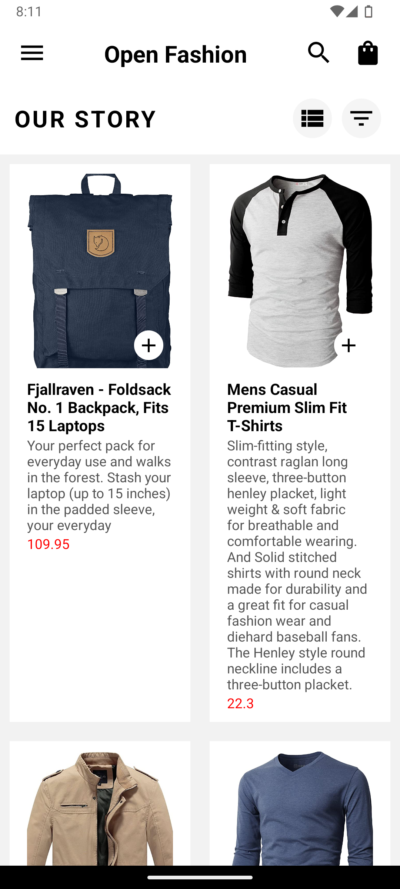
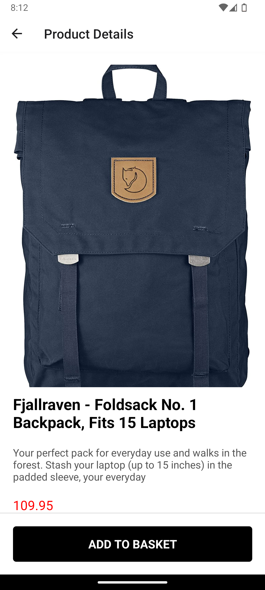
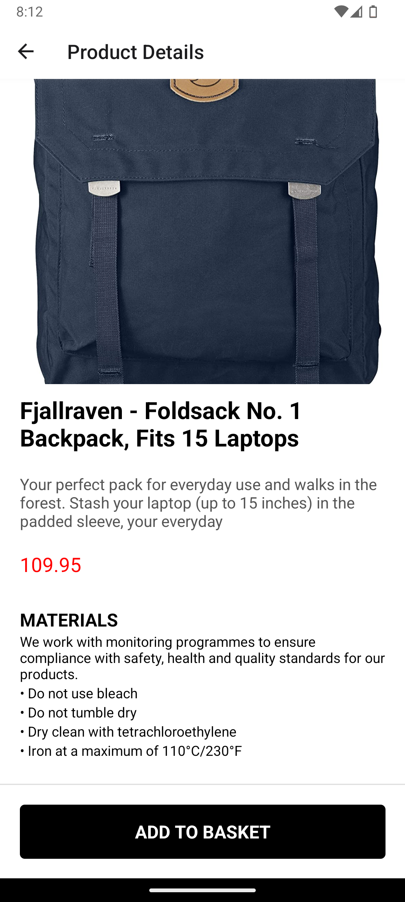
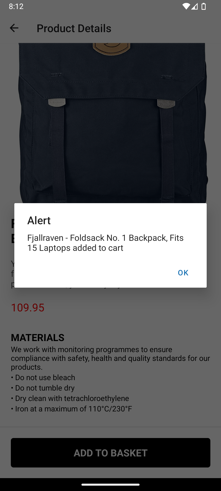
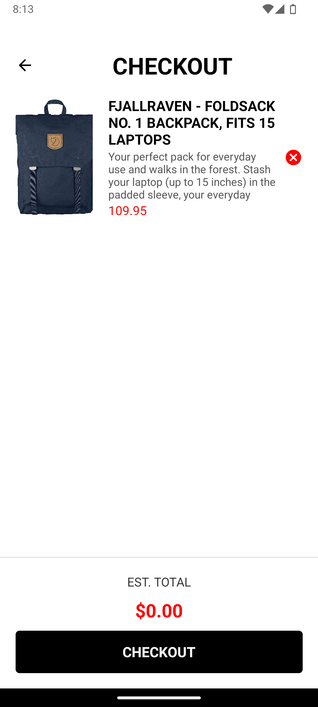

# REACT NATIVE APPLICATION

#### Student Name: Henry Amponsah

#### Student ID : 11358466

## Development Of App

The project follows a modular structure with separate directories for components, screens, and assets.  
It is maintainable, and user-friendly.
Navigation and UI components are customized to provide a seamless user experience.  
Data storage uses a combination of state management and AsyncStorage to ensure persistence and ease of use.

## Screenshots of Application [Running on Google Pixel 7a]

## Briefing:

This is an app created using 'react-native' and 'expo-go' frameworks.
